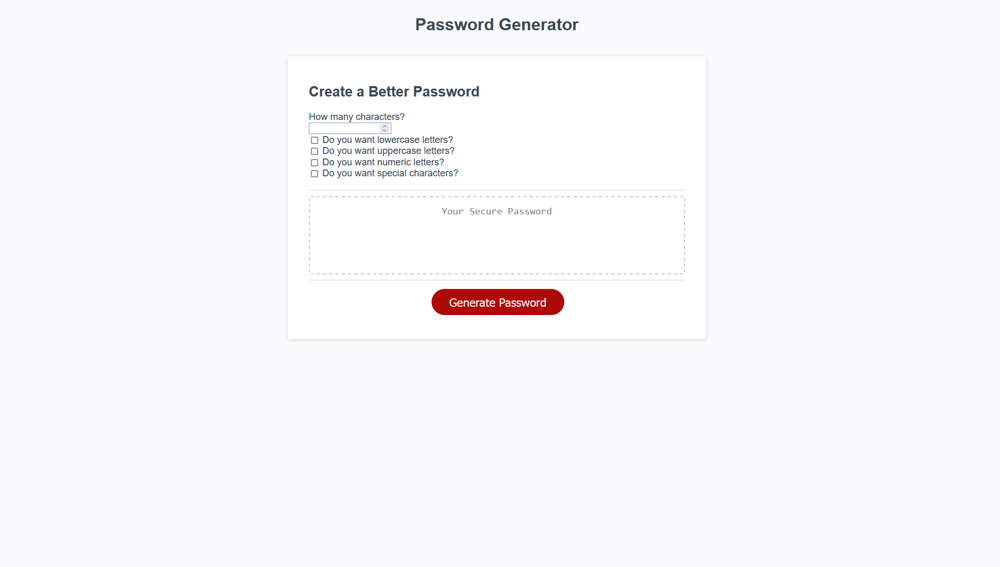

# Create-a-BETTER-Password

## User Story

AS A student

I WANT to build a fully functional password generator

SO THAT my password generator can be fully functional and create strong passwords

## Acceptance Criteria

GIVEN a that password generator is fully functionable. 

WHEN I successfully assemble a working password generator

WHEN I create a password generator that can deploy lowercase characters

WHEN I create a password generator that can deploy uppercase characters

WHEN I create a password generator that can deploy numerical characters

WHEN I create a password generator that can deploy special characters

When I have created an easy design for the user to design their password

WHEN I the generator is pushed out and live on the web

## Deployed URL 

https://garrettgonzo.github.io/Create-a-BETTER-Password/

## Website Screenshot

